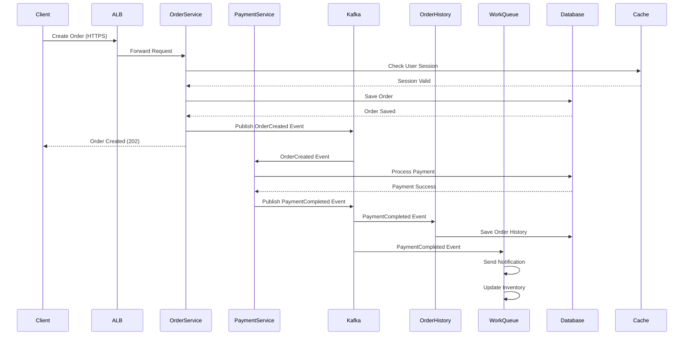
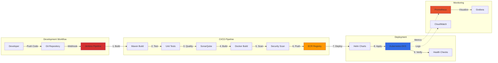

# E-Commerce Microservices Architecture on AWS

## System Architecture Diagram

```mermaid
graph TB
    subgraph "External"
        Client[Client/Browser]
        CI[Jenkins CI/CD]
    end

    subgraph "AWS Cloud"
        subgraph "Route 53"
            DNS[DNS Management]
        end

        subgraph "VPC - 10.0.0.0/16"
            subgraph "Public Subnets"
                ALB[Application Load Balancer]
                NAT[NAT Gateway]
            end

            subgraph "Private Subnets - EKS Cluster"
                subgraph "Microservices"
                    CS[Catalog Service]
                    CUS[Customer Service]
                    OS[Order Service]
                    OHS[Order History Service]
                    PS[Payment Service]
                    WQS[Work Queue Service]
                end

                subgraph "Supporting Services"
                    Prometheus[Prometheus]
                    Grafana[Grafana]
                end
            end

            subgraph "Private Subnets - Data Layer"
                RDS[(RDS PostgreSQL)]
                Redis[(ElastiCache Redis)]
                MSK[MSK Kafka Cluster]
            end
        end

        subgraph "AWS Services"
            ECR[Elastic Container Registry]
            SM[Secrets Manager]
            CW[CloudWatch]
            IAM[IAM]
            KMS[KMS]
        end
    end

    Client -->|HTTPS| DNS
    DNS -->|Route| ALB
    ALB -->|Route| CS
    ALB -->|Route| CUS
    ALB -->|Route| OS
    ALB -->|Route| OHS
    ALB -->|Route| PS
    ALB -->|Route| WQS

    CS -.->|Query| RDS
    CUS -.->|Query| RDS
    OS -.->|Query| RDS
    OHS -.->|Query| RDS
    PS -.->|Query| RDS

    CS -.->|Cache| Redis
    CUS -.->|Cache| Redis
    OS -.->|Cache| Redis

    OS -->|Publish Events| MSK
    PS -->|Publish Events| MSK
    WQS -->|Consume Events| MSK
    OHS -->|Consume Events| MSK

    CS -.->|Secrets| SM
    CUS -.->|Secrets| SM
    OS -.->|Secrets| SM
    OHS -.->|Secrets| SM
    PS -.->|Secrets| SM
    WQS -.->|Secrets| SM

    CS -.->|Logs/Metrics| CW
    CUS -.->|Logs/Metrics| CW
    OS -.->|Logs/Metrics| CW
    OHS -.->|Logs/Metrics| CW
    PS -.->|Logs/Metrics| CW
    WQS -.->|Logs/Metrics| CW

    CS -->|Metrics| Prometheus
    CUS -->|Metrics| Prometheus
    OS -->|Metrics| Prometheus
    OHS -->|Metrics| Prometheus
    PS -->|Metrics| Prometheus
    WQS -->|Metrics| Prometheus

    Prometheus -->|Visualize| Grafana

    CI -->|Push Images| ECR
    CI -->|Deploy| ALB

    style CS fill:#4CAF50
    style CUS fill:#4CAF50
    style OS fill:#4CAF50
    style OHS fill:#4CAF50
    style PS fill:#4CAF50
    style WQS fill:#4CAF50
    style RDS fill:#2196F3
    style Redis fill:#FF5722
    style MSK fill:#9C27B0
```

## Microservices Communication Flow

## Deployment Architecture

## Technology Stack

### Application Layer
- **Language**: Java 17
- **Framework**: Spring Boot 3.x
- **API**: RESTful APIs with OpenAPI/Swagger
- **Messaging**: Apache Kafka (MSK)
- **Caching**: Redis (ElastiCache)

### Infrastructure Layer
- **Container Orchestration**: Kubernetes (EKS 1.28)
- **Container Runtime**: Docker
- **Package Manager**: Helm 3.x
- **Infrastructure as Code**: Terraform 1.5+

### Data Layer
- **Primary Database**: PostgreSQL 15.4 (RDS)
- **Cache**: Redis 7.0 (ElastiCache)
- **Message Broker**: Apache Kafka 3.5.1 (MSK)

### DevOps & CI/CD
- **CI/CD**: Jenkins
- **Version Control**: Git
- **Container Registry**: Amazon ECR
- **Security Scanning**: Trivy, SonarQube

### Monitoring & Observability
- **Metrics**: Prometheus + Grafana
- **Logging**: CloudWatch Logs
- **APM**: Spring Boot Actuator
- **Tracing**: AWS X-Ray (optional)

### Security
- **Secrets**: AWS Secrets Manager
- **Identity**: IAM + IRSA
- **Encryption**: KMS
- **Network**: Security Groups, NACLs

## Network Architecture

### VPC Design

**CIDR**: 10.0.0.0/16 (65,536 IPs)

#### Public Subnets (2)
- **10.0.1.0/24** (AZ-a): 256 IPs - ALB, NAT Gateway
- **10.0.2.0/24** (AZ-b): 256 IPs - ALB (HA)

#### Private Subnets (2)
- **10.0.10.0/24** (AZ-a): 256 IPs - EKS Workers, RDS, Redis, MSK
- **10.0.11.0/24** (AZ-b): 256 IPs - EKS Workers, RDS, Redis, MSK (HA)

### Security Groups

1. **ALB Security Group**
   - Inbound: 80, 443 from 0.0.0.0/0
   - Outbound: All to VPC

2. **EKS Worker Security Group**
   - Inbound: 1025-65535 from ALB SG
   - Outbound: All

3. **RDS Security Group**
   - Inbound: 5432 from EKS Worker SG
   - Outbound: None

4. **ElastiCache Security Group**
   - Inbound: 6379 from EKS Worker SG
   - Outbound: None

5. **MSK Security Group**
   - Inbound: 9092, 9094, 2181 from EKS Worker SG
   - Outbound: All within VPC

## High Availability & Disaster Recovery

### High Availability

1. **Multi-AZ Deployment**
   - Application pods distributed across 2+ AZs
   - RDS Multi-AZ automatic failover
   - ElastiCache cluster mode
   - MSK multi-broker setup

2. **Load Balancing**
   - Application Load Balancer across AZs
   - Kubernetes Service load balancing
   - Health checks and auto-recovery

3. **Auto-Scaling**
   - Horizontal Pod Autoscaler (HPA)
   - Cluster Autoscaler
   - RDS storage autoscaling

### Disaster Recovery

1. **Backup Strategy**
   - **RTO**: 1 hour
   - **RPO**: 5 minutes
   - Automated RDS snapshots (daily)
   - Terraform state in S3 with versioning
   - GitOps for configuration

2. **Recovery Procedures**
   - Database restore from snapshot
   - Infrastructure recreation via Terraform
   - Application deployment via Helm
   - DNS failover to DR region (optional)

## Scalability Patterns

### Horizontal Scaling
- **Pods**: 2 to 10 replicas per service
- **Nodes**: 2 to 10 EC2 instances
- **Database**: Read replicas for read-heavy workloads

### Vertical Scaling
- **Pods**: Resource limits adjustable
- **Nodes**: Instance type upgrades
- **Database**: Instance class changes

### Caching Strategy
- **Application Cache**: Redis for session data
- **Query Cache**: PostgreSQL query cache
- **CDN**: CloudFront for static assets (optional)

## Security Architecture

### Defense in Depth

1. **Network Layer**
   - Private subnets for workloads
   - Security groups (stateful firewall)
   - Network ACLs (stateless firewall)
   - VPC Flow Logs

2. **Application Layer**
   - HTTPS/TLS encryption
   - JWT authentication
   - RBAC authorization
   - Input validation
   - SQL injection prevention

3. **Data Layer**
   - Encryption at rest (KMS)
   - Encryption in transit (TLS)
   - Database access controls
   - Secrets in Secrets Manager

4. **Platform Layer**
   - Pod Security Policies
   - Network Policies
   - IRSA for AWS access
   - Image scanning
   - Audit logging

## Cost Optimization Strategies

### Resource Optimization
1. **Right-sizing**: Monitor and adjust based on usage
2. **Spot Instances**: Dev/staging environments
3. **Reserved Instances**: Production stable workloads
4. **Auto-scaling**: Scale down during off-peak

### Storage Optimization
1. **S3 Lifecycle Policies**: Archive old logs
2. **EBS Snapshots**: Clean up old snapshots
3. **ECR Lifecycle**: Remove old images

### Monitoring & Alerts
1. **AWS Cost Explorer**: Track spending
2. **Budget Alerts**: Set spending limits
3. **Resource Tagging**: Cost allocation

## Performance Optimization

### Application Level
- Connection pooling (HikariCP)
- Async processing with Kafka
- Caching with Redis
- Database query optimization
- Lazy loading patterns

### Infrastructure Level
- CDN for static content
- Read replicas for databases
- Horizontal scaling
- Resource limits and requests
- Pod priority and preemption

## Compliance & Governance

### Compliance Requirements
- **PCI DSS**: Payment data handling
- **GDPR**: User data protection
- **SOC 2**: Security controls

### Governance
- **Tagging Strategy**: Resource organization
- **Access Control**: Least privilege
- **Audit Logging**: CloudTrail, EKS audit logs
- **Change Management**: GitOps workflow

## Future Enhancements

1. **Service Mesh**: Istio/Linkerd for advanced traffic management
2. **GitOps**: ArgoCD for declarative deployments
3. **Multi-Region**: Active-active or active-passive setup
4. **Chaos Engineering**: Resilience testing
5. **Advanced Monitoring**: Distributed tracing with Jaeger
6. **API Gateway**: AWS API Gateway or Kong
7. **GraphQL**: Unified API layer
8. **Event Sourcing**: CQRS pattern implementation

## References

- [AWS Well-Architected Framework](https://aws.amazon.com/architecture/well-architected/)
- [EKS Best Practices Guide](https://aws.github.io/aws-eks-best-practices/)
- [12-Factor App Methodology](https://12factor.net/)
- [Microservices Patterns](https://microservices.io/patterns/index.html)
